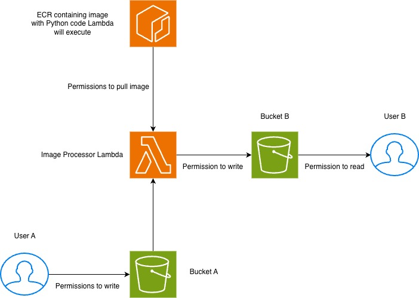

# strip\_image\_metadata\_stack

This repo contains terraform to deploy a lambda function which strips any exif metadata from JPG images.



**Figure.** Strip Image Metadata Architecture Design

<br>

## Testing Lambda Execution Locally

To test the lambda locally, first the docker image must be built:
```sh
# command assumes you are in repository rootdir
docker build -t <IMAGE-NAME> -f docker/Dockerfile .
```

Start the lambda container with:
```sh
docker run \
    -e AWS_ACCESS_KEY_ID=<ACCESS-KEY> \
    -e AWS_SECRET_ACCESS_KEY=<SECRET-KEY> \
    -e AWS_SESSION_TOKEN=<SESSION-TOKEN> \
    -e BUCKET_A=<INPUT-BUCKET> \
    -e BUCKET_B=<OUTPUT-BUCKET> \
    --user root -v /tmp:/tmp -p 9000:8080 <IMAGE-NAME>
```
**Please Note:** You have to specify root user when testing locally as otherwise will receive the error:
```sh
docker: Error response from daemon: unable to find user appuser: no matching entries in passwd file
```
This is due to the fact the lambda creates its own user and so when running locally that user isn't created and so Docker cannot find the password to use that user.

Send a request to the lambda container from a separate terminal window:
```sh
curl -XPOST "http://localhost:9000/2015-03-31/functions/function/invocations" \
  -d '{"input_jpg": "<INPUT-JPG-NAME>"}'
```

## Decisions Made
1. ECR Immutability - I wanted the container images to be immutable for historical referencing purposes. In 6 months, if lambda executions are looked back at then the image used will still be present under the same tag in ECR. The exception to this is the `latest` tag as this will be overwritten with the latest tag each time the image is deployed. If the lambda is executed with the `latest` tag then the date of other image tags can be used to workout which version of `latest` was used in that lambda execution.
2. Lambda Ephemeral Storage - I set the lambda ephemeral storage to `2.GB` as that seemed like a reasonable size to handle most images this lambda would process.
3. I gave both buckets versioning, this means that if an image is uploaded and the lambda is executed but then a user realises a mistake has been made in the image then they can upload the new version without wiping the old version. I am aware there is a cost implication with this.
4. I added intelligent tiering to bucket b only to add cost savings if the outputs have not been used in a while. I chose 30 days as an arbitrary value as I felt 1 month was a reasonable time to use the data before transitioning it.

## Additional Functionality Wanted
1. There is no CI set up for this repository, it would have been nice to demonstrate that via github actions. My envisioned CI would do the following:
* Push a new version of the image if `docker` or `src` directories have changes
* Run Terraform format, validate and plan if `terraform` directory has changes
* Manual Terraform apply if previous terraform steps pass

2. There is no `pre-commit` set up to run `terraform validate` and `terraform format` locally, this would save me from pushing faulty code.
3. I would like to add tagging to all the resources so I can track what resources I created and what costs are attributed to them.
4. I would like to automate the lambda so that when a file lands in the s3 bucket, the lambda is automatically trigged

## Known Tech Debt
1. Terraform version is set to the latest patch meaning that anyone else running this terraform stack on an older version of terraform will receive the error: `Error: Unsupported Terraform Core version`
2. The lambda, user and storage terraform is all stored in one directory rather than separating into appropriate stacks. This was done as I did not want to hardcode resource ARNs etc in files across stacks and did not have the time to set up parameter stores for these values.
3. The `latest` tag is hardcoded to be used in the lambda. Ideally the tag value would be stored in a parameter store parameter and retrieved. Then when the image is updated, this parameter value is updated with the new tag. The CI could also update the lambda image URI with: `aws lambda update-function-code`.
4. The ephemeral storage for the lambda has been set to an arbitrary number I decided upon, this risks lambda failure if the image is bigger than the ephemeral storage.
5. The python code is very basic. I would prefer to have a CLI using `click` that handles arguments. There is also no testing for this code, ideally `moto` should be used here. Finally, the python code should be separated by functionality: downloading from s3, image processing, writing to s3.
6. The `Dockerfile` relies on relative location for the `src` code so `docker run` commands would fail if they are not run from the repository root directory.
7. Some `user` resources and some `s3` resources are the same with a different name, to stop the code base growing organically this should be refactored to utilise maps and `for_each` iteration within a resource.

